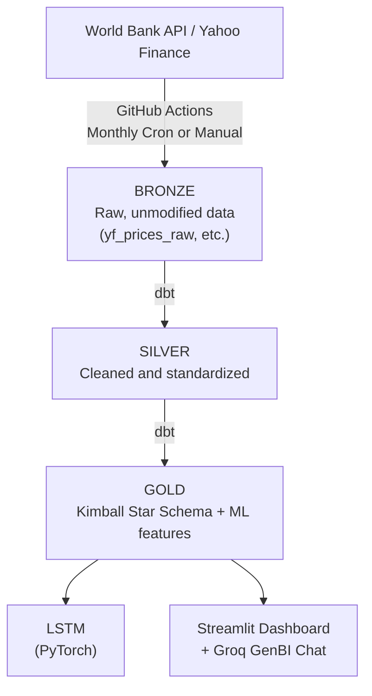
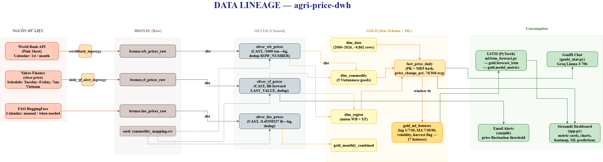
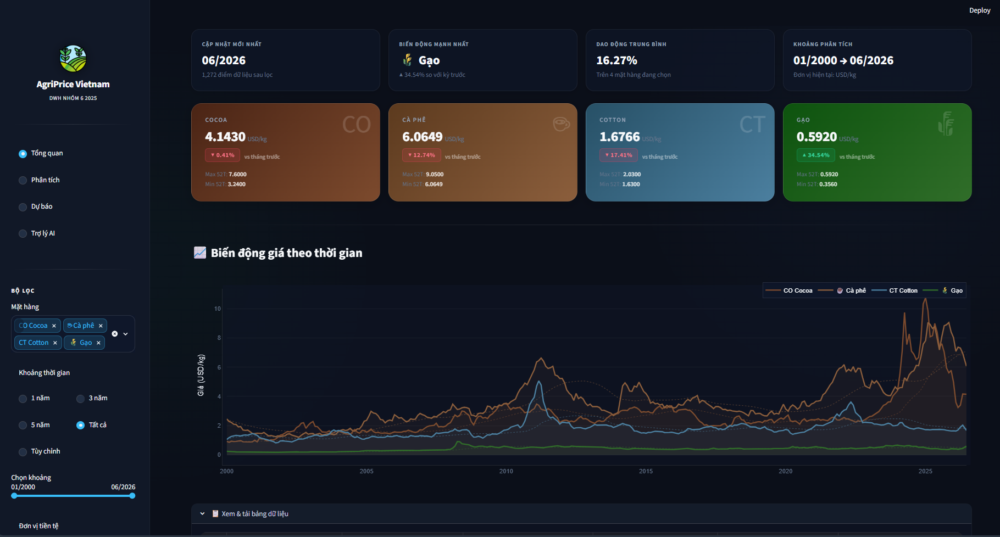
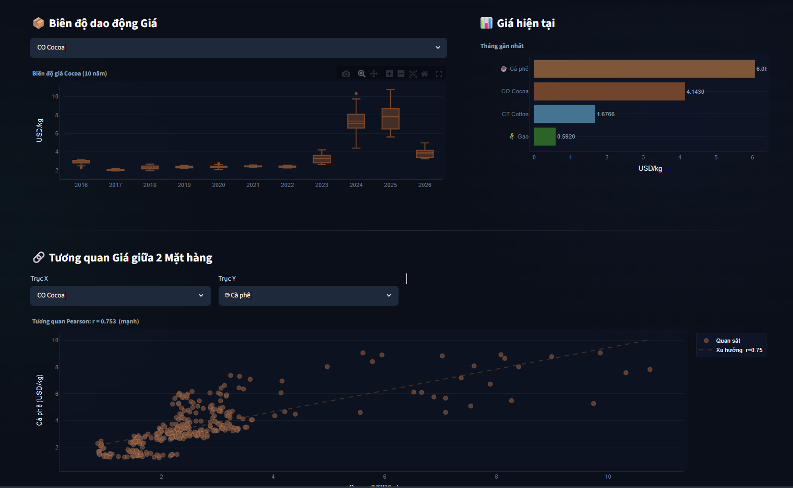
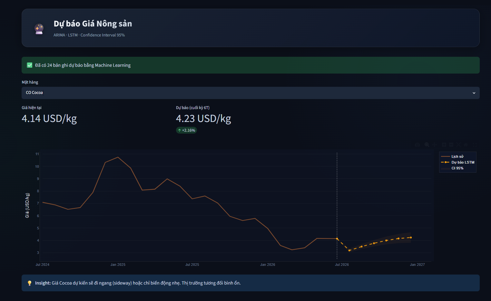
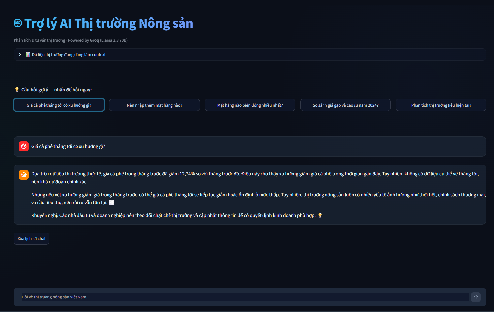
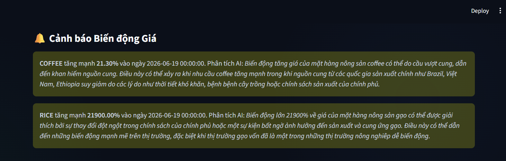
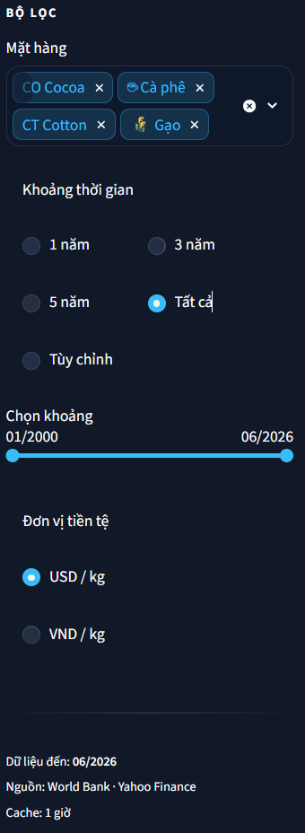

# 🌾 agri-price-dwh

> **Data Warehouse — Analysis & Forecasting of Vietnam Agricultural Prices**  
> Course: Data Warehouse & Integration | Team of 5 | 2025

[](https://github.com/LeGiaVan/agri-price-dwh/actions/workflows/daily_ingest.yml)
[](https://github.com/LeGiaVan/agri-price-dwh/actions/workflows/monthly_ingest.yml)

---

## 📋 Overview

A system that collects, cleans, stores, and forecasts prices for key agricultural export commodities of Vietnam. It tracks commodities such as rice, coffee, cocoa, and cotton using data from Yahoo Finance and the World Bank.

Architecture: **Medallion Architecture (Bronze → Silver → Gold)** built on MotherDuck + dbt + Streamlit GenBI.



### 📐 Full Data Lineage Diagram

<div align="center">
  
  <p><i>Data Lineage — agri-price-dwh (Source → Bronze → Silver → Gold → Consumption)</i></p>
</div>

---

## 📸 Screenshots & Features

<div align="center">
  
  <p><i>Main Dashboard - Market Overview</i></p>
</div>

<details>
<summary><b>Click here to view more features!</b></summary>

### 📈 Technical & Seasonal Analysis
<div align="center">
  
</div>

### 🔮 AI Price Forecasting (PyTorch LSTM)
<div align="center">
  
</div>

### 🤖 GenBI Virtual Assistant (Groq Llama 3)
<div align="center">
  
</div>

### ⚠️ Automated Price Alerts (Email Integration)
<div align="center">
  
</div>

### ⚙️ Interactive Filtering
<div align="center">
  
</div>

</details>

---

## 🗂️ Directory Structure

```text
agri-price-dwh/
├── .github/workflows/
│   └── ingest.yml          # GitHub Actions auto-trigger (Monthly Ingest)
├── dashboard/
│   ├── Dockerfile          # Lean Dockerfile for Streamlit
│   ├── requirements.txt    # Dashboard dependencies
│   ├── app.py              # Main Streamlit app
│   └── genbi_chat.py       # Groq AI integration
├── dbt/
│   ├── Dockerfile          # Lean Dockerfile for dbt
│   ├── dbt_project.yml     # dbt configuration
│   ├── profiles.yml        # MotherDuck connections
│   ├── models/             # Bronze, Silver, Gold transformations
│   ├── seeds/              # CSV seeds (e.g., commodity_mapping)
│   └── ...                 # Other dbt directories
├── ingest/
│   ├── Dockerfile          # Lean Dockerfile for ingestion
│   ├── requirements.txt    # Ingest dependencies
│   ├── daily_yf_alert_ingest.py # Daily YF incremental ingest script with Alerts (GitHub Actions)
│   ├── worldbank_ingest.py # World Bank API ingestion (Monthly)
│   └── utils.py            # Logger, MotherDuck connection, retry helpers
├── ml/
│   ├── models/             # Compiled weights (.h5)
│   └── notebooks/          # LSTM / ARIMA training notebooks
├── scripts/
│   └── db_init.py          # MotherDuck DB initialization script
├── .env.example            # Environment variables template
├── docker-compose.yml      # Root docker-compose for all services
├── Makefile                # Standardized developer commands (Linux/Mac)
├── run.bat                 # Standardized developer commands (Windows)
└── README.md
```

---

## ⚡ Quickstart

### 1. Clone the repository

```bash
git clone https://github.com/LeGiaVan/agri-price-dwh.git
cd agri-price-dwh
```

### 2. Set up Environment Variables

Copy the `.env.example` file to create your `.env` file:

```bash
cp .env.example .env
```

Open `.env` and fill in your actual tokens:

```env
MOTHERDUCK_TOKEN=md_token_xxxxxxxxxxxxx
GROQ_API_KEY=gsk_xxxxxxxxxxxxxxxxxxxxxxxxx
```

> 📌 **Where to get tokens?**
> - **MotherDuck**: [app.motherduck.com](https://app.motherduck.com) → Settings → Access Tokens
> - **Groq**: [console.groq.com](https://console.groq.com) → API Keys → Create

### 3. Initialize MotherDuck Database

Initialize the database schemas (`bronze`, `silver`, `gold`):

```bash
# Using Python locally:
pip install duckdb python-dotenv

# On Windows:
./run.bat init-db

# On Linux/Mac:
make init-db
```

*Expected output:*
```text
✅ Connected to MotherDuck
✅ Schema bronze created
✅ Schema silver created
✅ Schema gold created
```

### 4. Run Services with Docker

We use a `Makefile` (for Linux/Mac) and `run.bat` (for Windows) to simplify Docker commands. **Ensure Docker is running on your machine.**

```bash
# 1. Run Master Data Ingestion (World Bank and Yahoo Finance)
./run.bat ingest          # Windows
make ingest               # Linux/Mac

# 2. Run dbt Transformations (Bronze -> Silver -> Gold)
./run.bat run-dbt         # Windows
make run-dbt              # Linux/Mac

# 3. Start the Streamlit Dashboard (accessible at http://localhost:8501)
./run.bat run-dashboard   # Windows
make run-dashboard        # Linux/Mac

# 4. OR: Start EVERYTHING in the background at once
./run.bat start-all       # Windows
make start-all            # Linux/Mac
```

---

## 🤖 AI/ML Pipeline

| Model | Library | Objective | Metrics |
|---|---|---|---|
| **LSTM** | `PyTorch` | Time-series forecasting for the next 6 months using `price`, `lag`, `30d_avg` | MAPE < 10% |
| **GenBI** | `Groq` | Llama-3-70b powered Chatbot for real-time market data analysis | Response Time, Token Usage |
| **Alerts** | `smtplib` | Automated email alerts powered by AI-generated insights on sudden price drops | Delivery Success |

---

## 📊 Dashboard

The application is built with Streamlit and features the following components:

| Module | Content |
|---|---|
| **`app.py`** | Main Streamlit application with metric cards, line charts, seasonality heatmaps, correlations, and ML predictions. |
| **`genbi_chat.py`** | Vietnamese-supported GenBI chat powered by Groq Llama 3 for interacting with the data. |

---

## 🔧 Useful dbt Commands

If you choose to run dbt locally instead of via Docker:

```bash
cd dbt

# Test connection
dbt debug

# Run all models
dbt run

# Run specific layers
dbt run --select silver
dbt run --select gold

# Run tests
dbt test

# Generate and serve documentation locally
dbt docs generate && dbt docs serve
```

---

## 🚀 GitHub Actions Runbook

Dự án hiện có 2 workflows tách biệt trong `.github/workflows/`:
1. `daily_ingest.yml`: Chạy vào lúc 00:00 UTC (khoảng 7h sáng VN) từ Thứ 3 đến Thứ 7 hàng tuần. Chạy `daily_yf_alert_ingest.py` để kéo giá đóng cửa của ngày hôm trước từ Yahoo Finance, kiểm tra ngưỡng biến động, gửi Alert và lưu vào DB.
2. `monthly_ingest.yml`: Chạy vào ngày 1 hàng tháng để cập nhật số liệu của World Bank thông qua script `worldbank_ingest.py`.

**Required GitHub repository secrets:**
- `MOTHERDUCK_TOKEN`
- `GROQ_API_KEY`
- `EMAIL_SENDER`
- `EMAIL_PASSWORD`
- `EMAIL_RECEIVER`

**Manual rerun examples:**
```bash
python ingest/daily_yf_alert_ingest.py
python ingest/worldbank_ingest.py
```

---

## ❓ FAQ & Support

Encountering issues? Open an **Issue** on GitHub.  
For more details on the team's workflow, refer to [CONTRIBUTING.md](./CONTRIBUTING.md).
